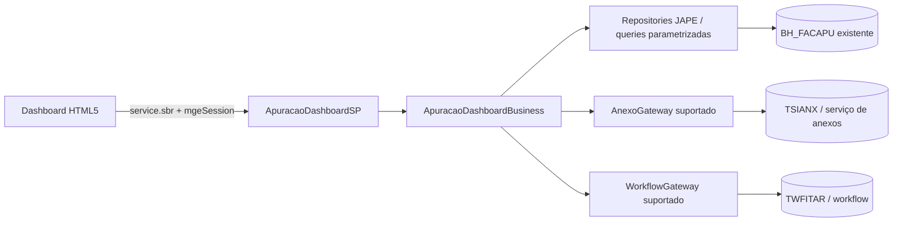

# Service Provider da Apuração de Faturas — Design

**Spec:** `spec.md`  
**Status:** In Progress — fundação, DTOs, casos de uso puros e leitura nativa
por chave concluídos; publicação e mutações dependem da homologação do Om.

## Abordagem recomendada

Usar um add-on SDK 2.x separado, com `@Controller` como fachada, `@Component`
para casos de uso e `@Repository`/adapters para o acesso às tabelas e serviços
existentes. O dashboard é cliente; a transação e a autorização permanecem no
backend.

Alternativas consideradas:

1. **Controller novo no add-on isolado (recomendado):** contrato estável,
   transação e autorização centralizadas; requer captura de metadata e novo
   pacote.
2. **Dashboard chamando serviços legados diretamente:** menor código inicial,
   mas acopla a versão desconhecida e não protege concorrência/erros.
3. **Recompilar o legado:** rejeitado porque o fonte não é comprovadamente o
   artefato instalado e mantém a dependência quebrada de `GridConfig`.

## Reuso e integração

| Fonte | Uso |
| --- | --- |
| `C:\projetos\sankhya-html5\.specs\features\facilita-apuracao-faturas` | Reusar escopo funcional, envelope preliminar e critérios da UI; o contrato deste add-on é a fonte executável do backend. |
| `C:\projetos\facilitatelecoment` | Usar apenas para levantar nomes de campos e fluxos; qualquer comportamento precisa de confirmação no Om. |
| Template Addon Studio atual | Reusar estrutura Gradle e módulos, não os exemplos, tabelas ou appKey. |
| Documentação oficial Sankhya | Validar `@Controller`, JAPE, repository, transação, Bean Validation e AutoDD. |

## Componentes planejados

### `ApuracaoDashboardController`

- **Local:** `model/src/main/java/<package-base>/apuracao/controller/`
- **Responsabilidade:** traduzir DTOs para casos de uso e expor as oito ações do
  contrato.
- **Dependências:** `ApuracaoDashboardBusiness`, mapper e gateways.
- **Restrições:** `@Controller(serviceName = "ApuracaoDashboardSP")`,
  injeção por construtor, DTOs na fronteira, sem SQL/regra.

### `ApuracaoDashboardBusiness`

- **Local:** `.../apuracao/business/`
- **Responsabilidade:** autorização de domínio, validação de estado,
  idempotência, concorrência e orquestração transacional.
- **Dependências:** repositories, `AnexoGateway`, `WorkflowGateway` e auditoria.

### `ApuracaoRepository`

- **Local:** `.../apuracao/repository/`
- **Responsabilidade:** consultas parametrizadas e mutações mínimas de
  `BH_FACAPU`, apenas após metadata confirmada.
- **Restrições:** `@Repository`/`JapeRepository`; `@Criteria` ou
  `@NativeQuery` parametrizada; sem concatenação de SQL; sem `SELECT *`.

### `AnexoGateway` e `WorkflowGateway`

- **Local:** `.../apuracao/integration/`
- **Responsabilidade:** encapsular APIs suportadas de anexo e workflow. Não
  acessar `TSIANX`/`TWFITAR` por SQL direto sem evidência e aprovação.

### DTOs, mapper e erros

- **Local:** `.../apuracao/api/` e `.../apuracao/error/`
- **Responsabilidade:** requests com `@Valid`, respostas sem entidades JAPE,
  envelope e códigos estáveis.

## Modelo de dados (somente leitura de metadata nesta fase)

| Objeto | Papel | Regra de mapeamento |
| --- | --- | --- |
| `BH_FACAPU` | apuração principal | entidade nativa existente; campos/chave somente após evidência do Om |
| `TSIANX` | anexos | acesso indireto pelo serviço/gateway homologado |
| `TWFITAR` | tarefas | consulta/abertura pelo workflow homologado |

Não usar `autoDD` para gerar XML dessas entidades. Se uma entidade JAPE nativa
for necessária, seu mapeamento deve ser marcado como `isNativeTable` e o build
deve continuar sem DDL; isso exige validação adicional antes de implementar.

## Transações e erros

- Leituras usam `NotSupported` quando não precisam de transação.
- `atualizar`, `confirmar`, `solicitarNovaAuditoria` e associação final do anexo
  usam `@Transactional` `REQUIRED`, com transações curtas.
- Nunca fazer I/O remoto ou upload longo dentro da transação; usar compensação
  explícita quando a API exigir duas etapas.
- Conflito de versão retorna `CONFLICT`; regra inválida retorna `VALIDATION`;
  permissão retorna `FORBIDDEN`; falha de serviço externo retorna
  `INTEGRATION`.
- `@ControllerAdvice` serializa falhas; não devolver stack trace ou SQL.

## Riscos e preocupações

| Concern | Impacto | Mitigação |
| --- | --- | --- |
| `autoDDL=true` e exemplos do template | criação acidental de objetos | T1 desabilitou AutoDDL e isolou os exemplos antes do código. |
| Plugin declarado como `2+` | API/compilação não reprodutível | A validação local resolveu `2.18.0`; a declaração foi preservada e deve ser fixada somente com autorização do mantenedor. |
| Metadata do cliente diverge do fonte | JAPE/SQL inválido | T2 captura entidade, PK, tipos e permissões no Om; lacunas bloqueiam escrita. |
| Upload/workflow têm contratos não comprovados | anexo órfão ou tarefa inacessível | gateways separados, idempotência, compensação e UAT por operação. |
| Sem testes locais de banco no template | regressão em queries | testes unitários mockados + smoke test manual no Om; não declarar cobertura sem evidência. |

## Decisões técnicas

| Decisão | Escolha | Motivo |
| --- | --- | --- |
| Fronteira pública | `@Controller` com sufixo `ControllerSP` | padrão SDK atual e contrato explícito |
| Persistência | repositories/queries parametrizadas | reduz SQL espalhado e injection |
| Schema | nenhuma migração | tabelas pertencem ao ambiente existente |
| Erros | envelope + `@ControllerAdvice` | UI consegue tratar erro sem expor detalhes |
| Identidade | novo appKey e package-base | evita colidir com template/legado |

## Referências verificadas

Context7 foi consultado primeiro, mas não retornou documentação Sankhya
confiável para Addon Studio (o resultado foi um projeto homônimo). O fallback
oficial usado para estruturar este design é:

- https://developer.sankhya.com.br/docs/iniciando
- https://developer.sankhya.com.br/docs/camada-de-controller-controller
- https://developer.sankhya.com.br/docs/repositorio-dados
- https://developer.sankhya.com.br/docs/mapeamento-relacional
- https://developer.sankhya.com.br/docs/controle-transacional
- https://developer.sankhya.com.br/docs/bean-validation
- https://developer.sankhya.com.br/docs/autodd-gera%C3%A7%C3%A3o-autom%C3%A1tica-do-dicion%C3%A1rio-de-dados-data-dictionary
- https://developer.sankhya.com.br/docs/02_autoddl
