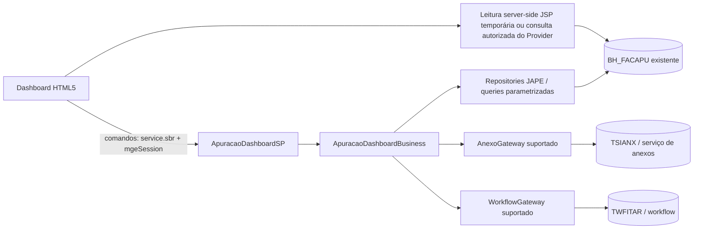

# Service Provider da Apuração de Faturas — Design

**Spec:** `spec.md`  
**Status:** In Progress — fundação, DTOs, casos de uso e leitura nativa por
chave existentes; o baseline funcional do legado foi reconciliado. Publicação
e mutações continuam dependentes da homologação do Om.

## Abordagem recomendada

Usar um add-on SDK 2.x separado, com `@Controller` como fachada, `@Component`
para casos de uso e `@Repository`/adapters para o acesso às tabelas e serviços
existentes. O dashboard é cliente; a transação e a autorização permanecem no
backend.

## Entrega incremental aprovada em 2026-09-23

O gadget substitui a grade quebrada sem transformar o navegador em autoridade
de negócio. A consulta pode permanecer temporariamente em JSP server-side,
somente leitura e sob os controles descritos na spec. Os filtros de dados
devem ser enviados/avaliados no servidor; filtros locais só organizam linhas já
autorizadas e carregadas.

O `ApuracaoDashboardSP` é a seam para comandos. Sua interface externa deve
permanecer pequena e estável; a implementação concentra autorização pelo
usuário corrente, validação do estado, persistência transacional e releitura.
Assim, o gadget não precisa duplicar regras nem conhecer detalhes JAPE.

Ordem de entrega:

1. Validar e homologar lista/detalhe em modo somente leitura, sem depender da
   publicação do Provider. Se a consulta JSP não comprovar parâmetros seguros
   e autorização, mover a leitura para o Provider antes de liberar a tela.
2. Habilitar primeiro uma mutação vertical, começando por edição de
   `VALOR`/`DTVENC`, com autorização, gravação condicional/concorrência
   comprovada, transação e releitura após commit.
3. Habilitar confirmação e nova auditoria como comandos subsequentes, cada um
   com sua permissão e transição legada validadas.
4. Tratar anexos e workflow em fase separada. Eles só entram no gate do MVP se
   o aceite funcional disser que a aprovação não pode ser concluída sem eles.

Alternativas consideradas:

1. **Controller novo no add-on isolado (recomendado):** contrato estável,
   transação e autorização centralizadas; requer captura de metadata e novo
   pacote.
2. **Dashboard chamando serviços legados diretamente:** menor código inicial,
   mas acopla a versão desconhecida e não protege concorrência/erros.
3. **Recompilar o legado:** rejeitado porque o fonte não é comprovadamente o
   artefato instalado e mantém a dependência quebrada de `GridConfig`.

## Reuso e integração

| Fonte | Uso |
| --- | --- |
| `C:\projetos\sankhya-html5\.specs\features\facilita-apuracao-faturas` | Reusar escopo funcional, envelope preliminar e critérios da UI; o contrato deste add-on é a fonte executável do backend. |
| `C:\projetos\facilitatelecoment` | Usar como baseline de comportamento visível e regras de negócio inequívocas; não reutilizar mecanismos internos, permissões ou serviços sem comprovação no Om. |
| Template Addon Studio atual | Reusar estrutura Gradle e módulos, não os exemplos, tabelas ou appKey. |
| Documentação oficial Sankhya | Validar `@Controller`, JAPE, repository, transação, Bean Validation e AutoDD. |

## Baseline comportamental do legado e adaptação

| Fluxo | Regra observada | Adaptação no Add-on |
| --- | --- | --- |
| Grade | Mês corrente e pendentes por padrão; busca antiga por número, conta, valor, referência e vencimento. | Formalizar filtros/allowlist no contrato; implementar consulta apenas com projeção, autorização e paginação comprovadas. |
| Edição/confirmar | Somente `VALOR` e `DTVENC` são editáveis; confirmação exige valor não nulo. | Manter allowlist no comando. Idempotência, versão e gravação condicional são proteções novas, ainda sem adapter homologado. |
| Nova auditoria | Para apuração confirmada, `BH_NOVAAUDIT` é lido do usuário corrente; limpa `IDINSTPRN`, `CONFIRMADO`, `AUDITORIAFINALIZADA`, `EMAILENVIADO` e `FATURAMENTOLIBERADO`. | Resolver a flag pela política de autorização do usuário da sessão, não por `ApuracaoSnapshot`; persistir somente depois de homologar permissão, concorrência e transação. Preservar valor, vencimento e anexo. |
| Anexos | Um arquivo, seis tipos legados e vínculo pela chave da apuração. | Preservar a allowlist como contrato provisório; conciliar a chave que o HTML5 realmente envia; usar gateway suportado, sem flag antecipada nem update direto em `TSIANX`. |
| Workflow | UI abre tarefa nativa com contexto de processo e tarefa; o legado busca tarefa não concluída. | Não portar a consulta direta a `TWFITAR` nem assumir `MIN(IDINSTTAR)` como escolha correta; aguardar serviço e regra autorizados. |

O fonte legado define a referência funcional, mas não demonstra equivalência
com o JAR instalado no cliente nem autoriza copiar `DynamicVO`, `JapeFactory`,
SQL de mutação, acesso ao filesystem ou permissões.

## Componentes planejados

### `ApuracaoDashboardController`

- **Local:** `model/src/main/java/<package-base>/apuracao/controller/`
- **Responsabilidade:** traduzir DTOs para casos de uso e expor somente ações
  implementadas e homologadas. O MVP ativa comandos em fatias; anexos e
  workflow não são publicados como operações funcionais enquanto seus
  adapters permanecerem bloqueados.
- **Dependências:** `ApuracaoDashboardBusiness`, mapper e gateways.
- **Restrições:** `@Controller(serviceName = "ApuracaoDashboardSP")`,
  injeção por construtor, DTOs na fronteira, sem SQL/regra.

### `ApuracaoDashboardBusiness`

- **Local:** `.../apuracao/business/`
- **Responsabilidade:** autorização de domínio, validação de estado,
  idempotência, concorrência e orquestração transacional.
- **Dependências:** repositories, `AnexoGateway`, `WorkflowGateway` e auditoria.

### `ApuracaoRepository`

- **Local:** `.../apuracao/repository/`
- **Responsabilidade:** consultas parametrizadas e mutações mínimas de
  `BH_FACAPU`, apenas após metadata confirmada.
- **Restrições:** `@Repository`/`JapeRepository`; `@Criteria` ou
  `@NativeQuery` parametrizada; sem concatenação de SQL; sem `SELECT *`.

### `AnexoGateway` e `WorkflowGateway`

- **Local:** `.../apuracao/integration/`
- **Responsabilidade:** encapsular APIs suportadas de anexo e workflow. Não
  acessar `TSIANX`/`TWFITAR` por SQL direto sem evidência e aprovação.

### DTOs, mapper e erros

- **Local:** `.../apuracao/api/` e `.../apuracao/error/`
- **Responsabilidade:** requests com `@Valid`, respostas sem entidades JAPE,
  envelope e códigos estáveis.

## Modelo de dados (somente leitura de metadata nesta fase)

| Objeto | Papel | Regra de mapeamento |
| --- | --- | --- |
| `BH_FACAPU` | apuração principal | entidade nativa existente; campos/chave somente após evidência do Om |
| `TSIANX` | anexos | acesso indireto pelo serviço/gateway homologado |
| `TWFITAR` | tarefas | consulta/abertura pelo workflow homologado |

Não usar `autoDD` para gerar XML dessas entidades. Se uma entidade JAPE nativa
for necessária, seu mapeamento deve ser marcado como `isNativeTable` e o build
deve continuar sem DDL; isso exige validação adicional antes de implementar.

## Transações e erros

- Leituras usam `NotSupported` quando não precisam de transação.
- `atualizar`, `confirmar`, `solicitarNovaAuditoria` e associação final do anexo
  usam `@Transactional` `REQUIRED`, com transações curtas.
- Nunca fazer I/O remoto ou upload longo dentro da transação; usar compensação
  explícita quando a API exigir duas etapas.
- Conflito de versão retorna `CONFLICT`; regra inválida retorna `VALIDATION`;
  permissão retorna `FORBIDDEN`; falha de serviço externo retorna
  `INTEGRATION`.
- `@ControllerAdvice` serializa falhas; não devolver stack trace ou SQL.

## Riscos e preocupações

| Concern | Impacto | Mitigação |
| --- | --- | --- |
| `autoDDL=true` e exemplos do template | criação acidental de objetos | T1 desabilitou AutoDDL e isolou os exemplos antes do código. |
| Plugin declarado como `2+` | API/compilação não reprodutível | A validação local resolveu `2.18.0`; a declaração foi preservada e deve ser fixada somente com autorização do mantenedor. |
| Metadata do cliente diverge do fonte | JAPE/SQL inválido | T2 captura entidade, PK, tipos e permissões no Om; lacunas bloqueiam escrita. |
| Upload/workflow têm contratos não comprovados | anexo órfão ou tarefa inacessível | gateways separados, idempotência, compensação e UAT por operação. |
| Chave de sessão do HTML5 difere da convenção legado validada no T10 | Upload válido da UI é rejeitado antes do gateway | Harmonizar cliente e Add-on, e só então homologar upload/associação. |
| `BH_NOVAAUDIT` pertence ao usuário, não à apuração | autorização incorreta ou bloqueio indevido | Resolver a flag na política do usuário corrente; não projetar esse dado no snapshot da apuração. |
| Sem testes locais de banco no template | regressão em queries | testes unitários mockados + smoke test manual no Om; não declarar cobertura sem evidência. |

## Decisões técnicas

| Decisão | Escolha | Motivo |
| --- | --- | --- |
| Fronteira pública | `@Controller` com sufixo `ControllerSP` | padrão SDK atual e contrato explícito |
| Persistência | repositories/queries parametrizadas | reduz SQL espalhado e injection |
| Schema | nenhuma migração | tabelas pertencem ao ambiente existente |
| Erros | envelope + `@ControllerAdvice` | UI consegue tratar erro sem expor detalhes |
| Identidade | novo appKey e package-base | evita colidir com template/legado |

## Referências verificadas

Context7 foi consultado primeiro, mas não retornou documentação Sankhya
confiável para Addon Studio (o resultado foi um projeto homônimo). O fallback
oficial usado para estruturar este design é:

- https://developer.sankhya.com.br/docs/iniciando
- https://developer.sankhya.com.br/docs/camada-de-controller-controller
- https://developer.sankhya.com.br/docs/repositorio-dados
- https://developer.sankhya.com.br/docs/mapeamento-relacional
- https://developer.sankhya.com.br/docs/controle-transacional
- https://developer.sankhya.com.br/docs/bean-validation
- https://developer.sankhya.com.br/docs/autodd-gera%C3%A7%C3%A3o-autom%C3%A1tica-do-dicion%C3%A1rio-de-dados-data-dictionary
- https://developer.sankhya.com.br/docs/02_autoddl
