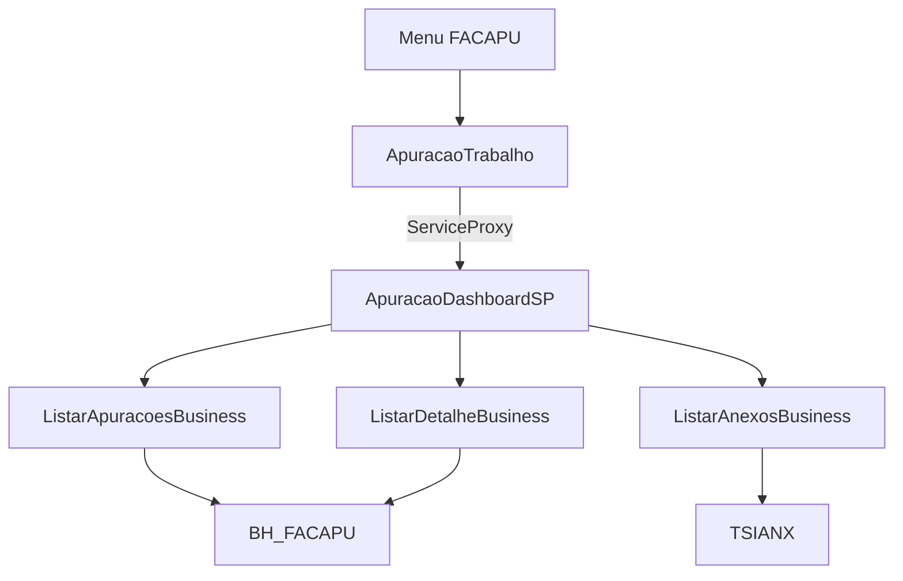
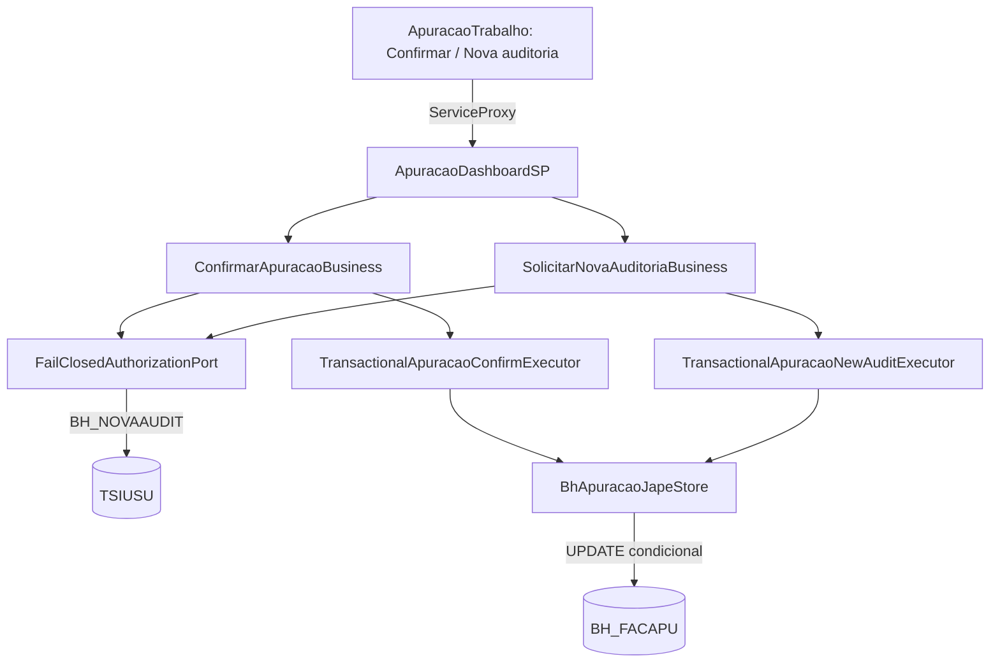
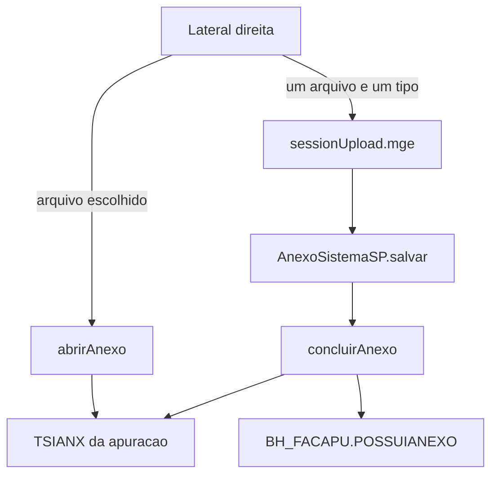

# Tela de Apuração no add-on — Design

**Spec**: `.specs/features/tela-apuracao-addon/spec.md`
**Status**: Approved

Cobre F1–F3 (TELA-01 a TELA-08, TELA-15), aprovado e entregue. A F4 está na seção [F4 — Confirmar e nova auditoria](#f4--confirmar-e-nova-auditoria). F7 e F8 estão na seção [F7 e F8 — Ver arquivo e anexar](#f7-e-f8--ver-arquivo-e-anexar). F5 e abrir tarefa não entram neste desenho.

## Architecture Overview

Uma única tela HTML5 do add-on substitui **Chamada da fachada** no menu `FACAPU`. O Angular `snk` injeta `ServiceProxy`. Cada ação chama `facilita-apuracao-fatura-addon@ApuracaoDashboardSP.{metodo}`. A grade deixa de nascer do `snk:query` do gadget e passa a nascer de `listar`.



Abordagem escolhida: uma tela que cresce nas features seguintes. Telas separadas por ação duplicariam o menu. Copiar o JSP do gadget para o `vc` não entrega `ServiceProxy`.

## Code Reuse Analysis

### Existing Components to Leverage

| Component | Location | How to Use |
| --- | --- | --- |
| Tela de prova | `vc/src/main/webapp/html5/ApuracaoChamada/` | Mesmo launcher e `ServiceProxy.callService` |
| Menu | `datadictionary/MENU_FACAPU.xml` | Trocar a `url` do item para a tela nova |
| `listarAnexos` | `ListarAnexosBusiness` + `BlockedAnexoGateway` | Já comprovado no Om; a tela só exibe `files` |
| `listarDetalhe` | `ListarDetalheBusiness` + `BhApuracaoReadAdapter.findById` | Liberar `DETAIL` na autorização |
| Filtro da grade | `ListarApuracoesRequest` / `ApuracaoFilter` | `mesReferencia`, `somentePendentes` |
| Consulta do gadget | `sankhya-html5/.../dados.jsp` | Critério de mês e de anexo; não copiar o JSP |

### Integration Points

| System | Integration Method |
| --- | --- |
| `ApuracaoDashboardSP` | `ServiceProxy.callService` com o nome qualificado do módulo |
| `BH_FACAPU` | Leitura allowlisted em `listar` e `listarDetalhe` |
| `TSIANX` | `NOMEINSTANCIA = 'bhApuracao'` e `PKREGISTRO = {nu}_bhApuracao` |

## Components

### ApuracaoTrabalho

- **Purpose**: Grade, detalhe e lista de anexos da apuração.
- **Location**: `vc/src/main/webapp/html5/ApuracaoTrabalho/`
- **Interfaces**:
  - `listar()` chama `...ApuracaoDashboardSP.listar` com mês corrente e `somentePendentes: true`
  - `abrirDetalhe(nuApuracao)` chama `listarDetalhe`
  - `verAnexos(nuApuracao)` chama `listarAnexos`
- **Dependencies**: `ServiceProxy`, `MessageUtils`, módulo `snk`
- **Reuses**: launcher de `ApuracaoChamada` e o padrão de `Martins.js`

### Leitura da grade

- **Purpose**: `listar` devolve a página do mês, só pendentes, sem `FORBIDDEN`.
- **Location**: `FailClosedAuthorizationPort`, `BhApuracaoReadAdapter`, `BhApuracaoRepository`
- **Interfaces**:
  - `requireAllowed(LIST | DETAIL | LIST_ATTACHMENTS)` retorna para usuário já presente na sessão
  - `find(ApuracaoFilter)` deixa de lançar `INTEGRATION` e consulta `BH_FACAPU`
- **Dependencies**: `ApuracaoQuery`
- **Reuses**: `findByNuApuracao` e o SQL de mês de `dados.jsp`

### Menu

- **Purpose**: Um único item abre a tela de trabalho.
- **Location**: `datadictionary/MENU_FACAPU.xml`
- **Interfaces**: `url` aponta para `/$ctx/ApuracaoTrabalho.xhtml5`
- **Dependencies**: nenhuma
- **Reuses**: `menu id="FACAPU"`

## Data Models

Grade, por linha, a partir de `BH_FACAPU`:

| Campo na tela | Coluna |
| --- | --- |
| Sequência | `NUAPURACAO` |
| Conta | `CODCONTA` |
| Contrato | `NUMCONTRATO` |
| Vencimento | `DTVENC` |
| Valor | `VALOR` |
| Confirmado | `CONFIRMADO` |
| Possui anexo | existência em `TSIANX` com a chave da apuração, não o flag `POSSUIANEXO` isolado |

Anexo já retornado: `identifier` = `NUATTACH`, `name` = `NOMEARQUIVO`.

Filtro inicial: `mesReferencia` no mês corrente `YYYY-MM`, `somentePendentes` verdadeiro. `REFERENCIA` da linha cai nesse mês, no mesmo corte do gadget.

## Error Handling Strategy

| Error Scenario | Handling | User Impact |
| --- | --- | --- |
| Envelope `ok: false` | A tela mostra `code`, `message` e `correlationId` | Mensagem da fachada, sem stack |
| `nuApuracao` inválido | `VALIDATION` já existente | Não consulta |
| Sessão sem usuário | `FORBIDDEN` já existente | Não lista |
| Falha de SQL | `INTEGRATION` com mensagem segura; causa no log | "A consulta falhou" |

## Risks & Concerns

| Concern | Location | Impact | Mitigation |
| --- | --- | --- | --- |
| `listar` ainda lança integração | `BhApuracaoReadAdapter.java` `find` | A grade não abre | Tarefa de leitura allowlisted antes da tela consumir `listar` |
| `LIST` e `DETAIL` ainda são `FORBIDDEN` | `FailClosedAuthorizationPort.java` | Grade e detalhe recusam o usuário logado | Abrir só essas duas ações, no mesmo critério de `LIST_ATTACHMENTS` |
| `POSSUIANEXO` diverge de `TSIANX` | evidência do gadget | A grade mente sobre anexo | O indicador da grade usa a mesma existência em `TSIANX` |
| HTML5 do add-on não tem teste automatizado | `vc/src/main/webapp/html5` | Regressão só aparece no Om | JUnit na fachada; a tela fecha com evidência no Om |
| Consulta sem teto | `listar` | Mês inteiro pode ser grande | `tamanhoPagina` máximo já é 500 no DTO; a tela pede uma página |

## Tech Decisions

| Decision | Choice | Rationale |
| --- | --- | --- |
| Uma tela | `ApuracaoTrabalho` substitui o item de menu | A spec tira **Chamada da fachada** na F1 |
| Indicador de anexo | `EXISTS` em `TSIANX` | É o critério que o gadget e a listagem comprovada usam |
| F4–F6 | Fora deste desenho | Confirmar, atualizar, upload e tarefa não são o MVP |

---

## F4 — Confirmar e nova auditoria

**Status**: Approved (gravação pela entidade JAPE, AD-008)
**Requisitos**: TELA-09, TELA-10, TELA-11 e os três edge cases de `confirmar`/`solicitarNovaAuditoria` da spec.

### Visão geral

Os casos de uso já existem: `ConfirmarApuracaoBusiness`, `SolicitarNovaAuditoriaBusiness` e os executores `@Transactional`. O que falta está na borda:

- `BhApuracaoJapeStore.findById` ainda lê por `@Criteria` na entidade parcial. Foi essa leitura que quebrou o detalhe no Om.
- `BhApuracaoJapeStore.confirm` e `requestNewAudit` lançam "aguarda homologação".
- `FailClosedAuthorizationPort` recusa `CONFIRM` e `REQUEST_NEW_AUDIT`.
- A tela não tem os botões.



### Abordagens de gravação

| Abordagem | Como grava | Prós | Contras |
| --- | --- | --- | --- |
| **A. UPDATE nativo condicional (recomendada)** | `@Modifying @NativeQuery` com o estado e a versão no `WHERE`; depois relê pelo SQL nativo do detalhe | Mesmo caminho de leitura já comprovado no Om. A condição no `WHERE` evita gravar sobre estado ou versão velhos | Não passa pelos eventos JAPE da instância `bhApuracao`; triggers do banco continuam valendo |
| B. `save` da entidade JAPE, como o legado | Carrega `BhApuracao`, altera os campos e chama `repository.save` | Dispara os eventos JAPE, como `dao.save` do legado | A carga da entidade parcial falhou no Om e a causa não foi registrada. Seria preciso provar antes |

**Decisão do usuário em 2026-09-29: B.** A gravação passa pela entidade JAPE para acionar os eventos de CRUD de `bhApuracao`, sejam os de hoje ou os que vierem. A carga da entidade precisa ser comprovada no Om antes das gravações. As seções de SQL de confirmação e nova auditoria abaixo ficam como referência do estado exigido, não como implementação.

### Idempotência

A porta `ApuracaoStore.confirm` pede que a chave idempotente seja reconhecida em um replay. Isso exige guardar a chave, e o projeto não cria tabela. A proposta é a idempotência pelo próprio estado:

- A gravação só acontece se a linha ainda estiver no estado esperado e com a mesma versão.
- Um reenvio depois do commit encontra a linha já confirmada e recebe `CONFLICT`, sem segundo efeito.
- A `idempotencyKey` continua obrigatória no contrato e vai para o log. Não é persistida.

Essa proposta muda o contrato escrito na porta. Por isso vira a decisão AD-008 no `STATE.md`, para aprovação.

### Componentes

#### Leitura do store

- **Onde**: `BhApuracaoJapeStore.findById`, `BhApuracaoSnapshotMapper`
- **O quê**: o store passa a ler por `repository.findDetalhe`. O mapeamento de `DetalheApuracaoRow` para `ApuracaoSnapshot` sai de `BhApuracaoReadAdapter` e vai para `BhApuracaoSnapshotMapper`, usado pelos dois.
- **Reusa**: `findDetalhe`, `BhApuracaoObservedVersion.format`

#### Confirmar

- **Onde**: `BhApuracaoRepository`, `BhApuracaoJapeStore.confirm`
- **SQL**:

```sql
UPDATE BH_FACAPU SET CONFIRMADO = 'S'
 WHERE NUAPURACAO = :nuApuracao
   AND NVL(CONFIRMADO, 'N') <> 'S'
   AND NVL(AUDITORIAFINALIZADA, 'N') <> 'S'
   AND VALOR IS NOT NULL
   AND NVL(TO_CHAR(VALOR), '#') = NVL(:valor, '#')
   AND NVL(TO_CHAR(DTVENC, 'YYYY-MM-DD'), '#') = NVL(:dtVenc, '#')
```

- **Antes do UPDATE**: lê a linha. Sem valor vira `VALIDATION`; confirmada ou com auditoria finalizada vira `CONFLICT`; versão diferente vira `CONFLICT`.
- **Depois do UPDATE**: relê. Se a linha não ficou confirmada, outro usuário mudou entre a leitura e a gravação: `CONFLICT`.
- A versão é quebrada em valor e vencimento pelo mesmo formato de `BhApuracaoObservedVersion`.

#### Nova auditoria

- **Onde**: `BhApuracaoRepository`, `BhApuracaoJapeStore.requestNewAudit`
- **SQL**:

```sql
UPDATE BH_FACAPU
   SET CONFIRMADO = 'N', AUDITORIAFINALIZADA = 'N', EMAILENVIADO = 'N',
       FATURAMENTOLIBERADO = 'N', IDINSTPRN = NULL
 WHERE NUAPURACAO = :nuApuracao
   AND NVL(CONFIRMADO, 'N') = 'S'
   AND NVL(TO_CHAR(VALOR), '#') = NVL(:valor, '#')
   AND NVL(TO_CHAR(DTVENC, 'YYYY-MM-DD'), '#') = NVL(:dtVenc, '#')
```

- Mesmos campos que o legado limpa. `VALOR`, `DTVENC` e anexos ficam como estão.
- Relê depois do UPDATE. Se continuar confirmada: `CONFLICT`.

#### Autorização

- **Onde**: `FailClosedAuthorizationPort`, entidade parcial `Usuario` (`TSIUSU`, só `CODUSU` e `BH_NOVAAUDIT`) e `UsuarioRepository`
- **Regra**:
  - `CONFIRM` passa para o usuário da sessão. O legado não exige permissão para confirmar.
  - `REQUEST_NEW_AUDIT` passa só se `NVL(BH_NOVAAUDIT, 'N') = 'S'` em `TSIUSU` para o `CODUSU` da sessão. Caso contrário: `FORBIDDEN`.
  - `UPDATE`, `ATTACH` e `VIEW_TASK` seguem fechados.
- **SQL**: `SELECT NVL(BH_NOVAAUDIT, 'N') AS BH_NOVAAUDIT FROM TSIUSU WHERE CODUSU = :codUsu`
- Falha na leitura da flag nega com `FORBIDDEN` e grava a causa no log.

#### Tela

- **Onde**: `ApuracaoTrabalho.html` e `ApuracaoTrabalho.js`
- No detalhe: **Confirmar** quando `confirmado` é `N`; **Solicitar nova auditoria** quando é `S`.
- Envia `nuApuracao`, a `version` do detalhe exibido e uma `idempotencyKey` nova por clique.
- Em sucesso, mostra o detalhe devolvido e refaz a grade. Em erro, mostra `code`, `message` e `correlationId`.
- O botão fica desabilitado enquanto a chamada está em curso.

### Tratamento de erros

| Cenário | Código | O usuário vê |
| --- | --- | --- |
| Confirmar sem valor | `VALIDATION` | Mensagem de valor obrigatório |
| Confirmar linha já confirmada ou finalizada | `CONFLICT` | Recarregue os dados |
| Versão diferente da exibida | `CONFLICT` | Recarregue os dados |
| Nova auditoria sem `BH_NOVAAUDIT = 'S'` | `FORBIDDEN` | Sem permissão para nova auditoria |
| Falha de SQL na gravação | `INTEGRATION` | Mensagem segura; causa no log |

### Riscos

| Risco | Onde | Mitigação |
| --- | --- | --- |
| `TSIUSU.BH_NOVAAUDIT` não confirmado no Om de produção | autorização | Tarefa T1 confirma a coluna antes de codificar a regra. O legado lê esse campo |
| UPDATE nativo não dispara eventos JAPE de `bhApuracao` | `BhApuracaoJapeStore` | Nenhum listener no fonte legado. O UAT confere a linha depois de confirmar |
| Reenvio depois do commit devolve `CONFLICT`, não sucesso | contrato da porta | AD-008; a tela desabilita o botão e recarrega o detalhe |
| `atualizar` (F5) continua com `loadEntity` por `@Criteria` | `BhApuracaoJapeStore.updateEditableFields` | Fora da F4. Tratar no desenho da F5 |
| Mensagens com acento aparecem quebradas no Om | fontes em UTF-8 | Mensagens novas sem acento; conversão para ISO-8859-1 em tarefa própria |

### Invariante de schema

Nenhum DDL. `UPDATE` só nas colunas que o legado já grava em `BH_FACAPU`. `TSIUSU` é só lida. As entidades novas são parciais e nativas (`isNativeTable = true`); `autoDDL` continua `false`.

---

# F7 e F8 — Ver arquivo e anexar

**Spec**: TELA-16 e TELA-17
**Status**: Draft
**Decisão de projeto**: AD-009

A lateral direita da tela do menu concentra detalhe, confirmar, nova auditoria, a lista de anexos, Ver e Enviar. A grade fica à esquerda. A lista é o seletor: Ver abre o item escolhido. Cada envio grava um arquivo; outro envio grava outro.



Abordagem escolhida: a associação do arquivo usa o serviço oficial já documentado, `AnexoSistemaSP.salvar`, chamado pela tela com `ServiceProxy`, como a tela antiga. A regra da Facilita (nome composto e `POSSUIANEXO`) fica em `concluirAnexo`, no add-on. Ver arquivo só devolve URL depois de conferir que o `NUATTACH` pertence à apuração. A URL em si continua pendente de evidência no Om: o botão antigo abre o mais recente por `visualizadorArquivos.facilita?nuApuracao=`, e isso não escolhe o item da lista.

## Code Reuse

| Componente | Onde | Uso |
| --- | --- | --- |
| `listarAnexos` | `BlockedAnexoGateway` | A lista da lateral continua com identificador e nome |
| `AnexarBusiness` | validação de tipo `FO`, `2V`, `FA`, `BO`, `NF`, `RE` e da chave `ANEXO_SISTEMA_bhApuracao_{nu}` | A tela usa a mesma chave no upload |
| `AnexoSistemaSP.salvar` | documentação oficial `developer.sankhya.com.br/reference/get_anexaarquivos` | Associação em `TSIANX`. Parâmetros iguais aos de `Apuracao.js` `createANX`: `pkEntity`, `keySession`, `nameEntity=bhApuracao`, `typeAcess=ALL`, `typeApres=GLO`, `fileSelect=1` |
| `atualizaTipoAnexo` | `AnexosModel.java` | Fórmula do nome, não a chamada do serviço legado |
| `FailClosedAuthorizationPort` | sessão | `ATTACH` passa a valer para o usuário da sessão. `VIEW_TASK` continua fechado |

## Componentes

### Lateral

- **Purpose**: Detalhe, ações e anexos à direita.
- **Location**: `vc/src/main/webapp/html5/ApuracaoTrabalho/`
- **Interfaces**: clique num item da lista seleciona; Ver fica desabilitado sem seleção ou sem anexo; Enviar fica desabilitado sem arquivo ou sem tipo.
- **Reuses**: `chamar`, `mostrarErro`

### abrirAnexo

- **Purpose**: Autorizar a abertura do item escolhido.
- **Location**: `ApuracaoDashboardController.abrirAnexo`, business novo
- **Interfaces**: entrada `nuApuracao` e `nuAttach`. Se a linha não existir nessa chave `{nu}_bhApuracao`, `VALIDATION`. Se `CHAVEARQUIVO` estiver vazio, `INTEGRATION`. A URL só entra depois da evidência no Om.
- **Reuses**: `LIST_ATTACHMENTS`, já aberto para a sessão

### concluirAnexo

- **Purpose**: Aplicar o nome do legado e marcar `POSSUIANEXO` depois da associação.
- **Location**: business novo, chamado pela tela após `AnexoSistemaSP.salvar` devolver o `nuAttach`
- **Interfaces**: entrada `nuApuracao`, `nuAttach`, `tipo`. Grava `BH_TIPO`, `NOMEARQUIVO` e `DESCRICAO` na linha que já pertence à apuração. Em seguida `POSSUIANEXO = S` pela entidade `bhApuracao`.
- **Fórmula**, igual a `AnexosModel.atualizarTipoAnexo`: `{IDENTIFICADOR}_{ano}_{mês}_{CGC_CPF}_{tipo}{extensão}`. O mês é o mês civil sem zero à esquerda (`9`, não `09`). A extensão é o trecho do nome original a partir do primeiro `.`. `DESCRICAO` é `NOMEPARC` da operadora. `IDENTIFICADOR` vem de `BH_FACCON`. `CGC_CPF` vem do parceiro de `BH_FACCON.TITULARIDADE`. `NOMEPARC` vem do parceiro de `BH_FACCON.OPERADORA`.
- **Antes do upload**: se não houver vencimento, parceiro ou ponto no nome do arquivo, a fachada responde `VALIDATION` e a tela não chama `AnexoSistemaSP.salvar`.
- **Reuses**: `repository.save` da apuração, para o `ApuracaoListener` do legado continuar vendo a gravação

### Leitura do nome

```sql
SELECT CON.IDENTIFICADOR, OPE.NOMEPARC, TIT.CGC_CPF, APU.DTVENC
  FROM BH_FACAPU APU
  JOIN BH_FACCON CON ON CON.CODCONTA = APU.CODCONTA
  LEFT JOIN TGFPAR OPE ON OPE.CODPARC = CON.OPERADORA
  LEFT JOIN TGFPAR TIT ON TIT.CODPARC = CON.TITULARIDADE
 WHERE APU.NUAPURACAO = :nuApuracao
```

`TGFPAR` é a tabela de parceiro do Sankhya. O UAT confere o nome gerado com um envio novo; um arquivo antigo pode ter sido renomeado à mão.

## Erros

| Cenário | Código | O usuário vê |
| --- | --- | --- |
| Ver sem item escolhido | a tela não chama | Botão desabilitado |
| `nuAttach` de outra apuração | `VALIDATION` | Mensagem segura e `correlationId` |
| Sem vencimento, sem parceiro ou sem ponto no nome | `VALIDATION` | Nada é associado |
| `AnexoSistemaSP.salvar` ou a troca do nome falha | `INTEGRATION` | `code`, `message`, `correlationId`. Se a linha já nasceu em `TSIANX`, a pessoa apaga no Om |
| Tipo fora da lista | `VALIDATION` | Nada é associado |

## Riscos

| Concern | Onde | Impacto | Mitigação |
| --- | --- | --- | --- |
| A URL que abre um `NUATTACH` escolhido não está no fonte | `Apuracao.js` abre só `?nuApuracao=`, e isso pega o mais recente | Ver o item errado | Tarefa de evidência no Om antes de ligar o botão. Sem URL comprovada, Ver não abre janela |
| `salvar` pode gravar e `concluirAnexo` falhar | ordem tela → serviço oficial → add-on | Anexo com o nome original, sem a composição | A validação de vencimento, parceiro e extensão ocorre antes do upload. O que sobrar, a pessoa exclui no Om |
| `putFileSession` do legado não coloca o arquivo na sessão | `AnexosModel.java` linha do `putHttpSessionAttribute` comentada | Copiar esse método não abre o PDF | Não reutilizar `putFileSession` |
| Join `TGFPAR` ainda não foi lido no Om desta tela | SQL acima | Nome composto errado | O teste de unidade cobre a fórmula com valores fixos. O UAT compara um arquivo recém-enviado |
| CPF/CNPJ no nome | `NOMEARQUIVO` | Dado pessoal no anexo, como o cliente já vê hoje | AD-009. A tela não inventa outro formato |

## Decisões desta seção

| Decisão | Escolha | Por quê |
| --- | --- | --- |
| Quem associa o arquivo | A tela chama `AnexoSistemaSP.salvar` | Serviço oficial documentado; a tela antiga já faz isso na sessão |
| Quem compõe o nome | `concluirAnexo` no add-on | A regra é da Facilita, não do `AnexoSistemaSP` |
| `POSSUIANEXO` | Só depois da troca do nome | Evita o indicador mentiroso do legado, que marca `S` antes |
| Ver | URL só com evidência, e só para `NUATTACH` da apuração | Não chutar parâmetro de servlet |
