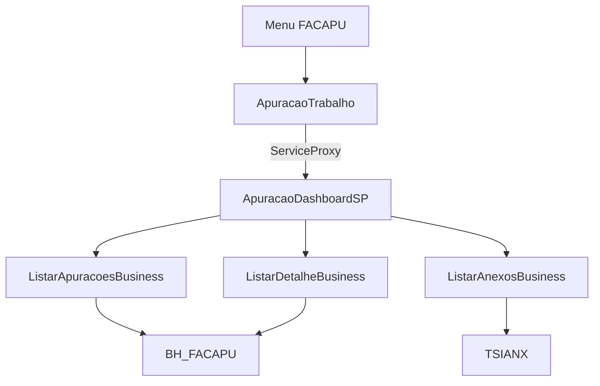

# Tela de Apuração no add-on — Design

**Spec**: `.specs/features/tela-apuracao-addon/spec.md`
**Status**: Approved

Cobre F1–F3 (TELA-01 a TELA-08). F4–F6 permanecem na spec e não entram neste desenho.

## Architecture Overview

Uma única tela HTML5 do add-on substitui **Chamada da fachada** no menu `FACAPU`. O Angular `snk` injeta `ServiceProxy`. Cada ação chama `facilita-apuracao-fatura-addon@ApuracaoDashboardSP.{metodo}`. A grade deixa de nascer do `snk:query` do gadget e passa a nascer de `listar`.

Abordagem escolhida: uma tela que cresce nas features seguintes. Telas separadas por ação duplicariam o menu. Copiar o JSP do gadget para o `vc` não entrega `ServiceProxy`.

## Code Reuse Analysis

### Existing Components to Leverage

| Component | Location | How to Use |
| --- | --- | --- |
| Tela de prova | `vc/src/main/webapp/html5/ApuracaoChamada/` | Mesmo launcher e `ServiceProxy.callService` |
| Menu | `datadictionary/MENU_FACAPU.xml` | Trocar a `url` do item para a tela nova |
| `listarAnexos` | `ListarAnexosBusiness` + `BlockedAnexoGateway` | Já comprovado no Om; a tela só exibe `files` |
| `listarDetalhe` | `ListarDetalheBusiness` + `BhApuracaoReadAdapter.findById` | Liberar `DETAIL` na autorização |
| Filtro da grade | `ListarApuracoesRequest` / `ApuracaoFilter` | `mesReferencia`, `somentePendentes` |
| Consulta do gadget | `sankhya-html5/.../dados.jsp` | Critério de mês e de anexo; não copiar o JSP |

### Integration Points

| System | Integration Method |
| --- | --- |
| `ApuracaoDashboardSP` | `ServiceProxy.callService` com o nome qualificado do módulo |
| `BH_FACAPU` | Leitura allowlisted em `listar` e `listarDetalhe` |
| `TSIANX` | `NOMEINSTANCIA = 'bhApuracao'` e `PKREGISTRO = {nu}_bhApuracao` |

## Components

### ApuracaoTrabalho

- **Purpose**: Grade, detalhe e lista de anexos da apuração.
- **Location**: `vc/src/main/webapp/html5/ApuracaoTrabalho/`
- **Interfaces**:
  - `listar()` chama `...ApuracaoDashboardSP.listar` com mês corrente e `somentePendentes: true`
  - `abrirDetalhe(nuApuracao)` chama `listarDetalhe`
  - `verAnexos(nuApuracao)` chama `listarAnexos`
- **Dependencies**: `ServiceProxy`, `MessageUtils`, módulo `snk`
- **Reuses**: launcher de `ApuracaoChamada` e o padrão de `Martins.js`

### Leitura da grade

- **Purpose**: `listar` devolve a página do mês, só pendentes, sem `FORBIDDEN`.
- **Location**: `FailClosedAuthorizationPort`, `BhApuracaoReadAdapter`, `BhApuracaoRepository`
- **Interfaces**:
  - `requireAllowed(LIST | DETAIL | LIST_ATTACHMENTS)` retorna para usuário já presente na sessão
  - `find(ApuracaoFilter)` deixa de lançar `INTEGRATION` e consulta `BH_FACAPU`
- **Dependencies**: `ApuracaoQuery`
- **Reuses**: `findByNuApuracao` e o SQL de mês de `dados.jsp`

### Menu

- **Purpose**: Um único item abre a tela de trabalho.
- **Location**: `datadictionary/MENU_FACAPU.xml`
- **Interfaces**: `url` aponta para `/$ctx/ApuracaoTrabalho.xhtml5`
- **Dependencies**: nenhuma
- **Reuses**: `menu id="FACAPU"`

## Data Models

Grade, por linha, a partir de `BH_FACAPU`:

| Campo na tela | Coluna |
| --- | --- |
| Sequência | `NUAPURACAO` |
| Conta | `CODCONTA` |
| Contrato | `NUMCONTRATO` |
| Vencimento | `DTVENC` |
| Valor | `VALOR` |
| Confirmado | `CONFIRMADO` |
| Possui anexo | existência em `TSIANX` com a chave da apuração, não o flag `POSSUIANEXO` isolado |

Anexo já retornado: `identifier` = `NUATTACH`, `name` = `NOMEARQUIVO`.

Filtro inicial: `mesReferencia` no mês corrente `YYYY-MM`, `somentePendentes` verdadeiro. `REFERENCIA` da linha cai nesse mês, no mesmo corte do gadget.

## Error Handling Strategy

| Error Scenario | Handling | User Impact |
| --- | --- | --- |
| Envelope `ok: false` | A tela mostra `code`, `message` e `correlationId` | Mensagem da fachada, sem stack |
| `nuApuracao` inválido | `VALIDATION` já existente | Não consulta |
| Sessão sem usuário | `FORBIDDEN` já existente | Não lista |
| Falha de SQL | `INTEGRATION` com mensagem segura; causa no log | "A consulta falhou" |

## Risks & Concerns

| Concern | Location | Impact | Mitigation |
| --- | --- | --- | --- |
| `listar` ainda lança integração | `BhApuracaoReadAdapter.java` `find` | A grade não abre | Tarefa de leitura allowlisted antes da tela consumir `listar` |
| `LIST` e `DETAIL` ainda são `FORBIDDEN` | `FailClosedAuthorizationPort.java` | Grade e detalhe recusam o usuário logado | Abrir só essas duas ações, no mesmo critério de `LIST_ATTACHMENTS` |
| `POSSUIANEXO` diverge de `TSIANX` | evidência do gadget | A grade mente sobre anexo | O indicador da grade usa a mesma existência em `TSIANX` |
| HTML5 do add-on não tem teste automatizado | `vc/src/main/webapp/html5` | Regressão só aparece no Om | JUnit na fachada; a tela fecha com evidência no Om |
| Consulta sem teto | `listar` | Mês inteiro pode ser grande | `tamanhoPagina` máximo já é 500 no DTO; a tela pede uma página |

## Tech Decisions

| Decision | Choice | Rationale |
| --- | --- | --- |
| Uma tela | `ApuracaoTrabalho` substitui o item de menu | A spec tira **Chamada da fachada** na F1 |
| Indicador de anexo | `EXISTS` em `TSIANX` | É o critério que o gadget e a listagem comprovada usam |
| F4–F6 | Fora deste desenho | Confirmar, atualizar, upload e tarefa não são o MVP |
